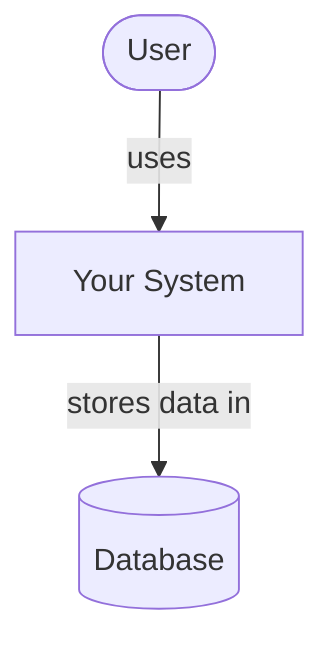
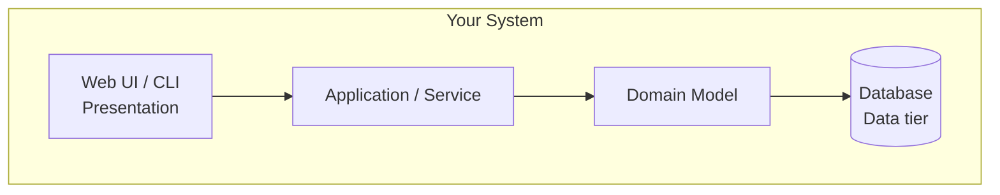
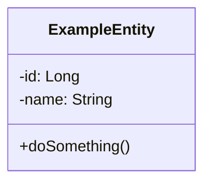
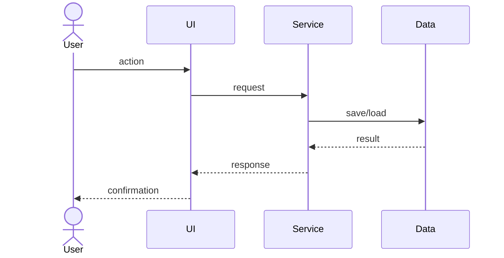

# [School Information System]

<!-- CI badge: after Session 4, replace ORG/REPO and the workflow filename, then uncomment:

-->

**Student:** Joseph Gabrie · **Course:** CEN 5064 Software Design, Fall 2026 · **Partner:** @Jesse-Trueba

## Project (approval paragraph — write this by Sun Aug 30)

My project is a school information system(ISS) built for a k-8 school. 
The features that it needs to have are:
1. AI submission detection System
2. Attendance system
3. Assignmnet/Quiz system
4. Notification System

My tech stack will be to use React for my FrontEnd, Golang for my backend, and MySQL for my Database.
## How to run

```
[Exact commands to build and run your system from a clean clone.
Update this every time the steps change — your partner and your
instructor will follow it literally on conference days.]
```

## Architecture

### Tier breakdown (Session 2 studio)

| Tier | Responsibilities in THIS system |
|------|------| --------------------------------|
| Presentation | Present classes, show grades, show student attendance. |
| Service | create/submit an assignment| Create a class announcement| view grades|direct user to their respective page depending if they are a parent, teacher, student, and or admin. |
| Domain | What grades are I.E., A: 100 - 90, B:89-80, etc. Students can't have two classes that overlap in time| Students can't take classes without meeting the prerequisites |
| Data | assignments, grades, user info, etc stored in the MySQL database |

### C4 — Context & Container (Session 3 studio)





### UML — Class & Sequence (Session 3 studio)





## Architecture Decision Records

Decisions live in [`docs/adr/`](docs/adr/). Start with ADR-001 in Session 4.

| # | Decision | Status |
|---|----------|--------|
| [001](docs/adr/adr-001.md) | [What I am building and why] | [proposed] |

## Weekly log (optional but recommended)

A one-line note per week keeps your commit story readable:

- Week 1 (Aug 24): repo created, three ideas drafted
- Week 2 (Aug 31): ...
